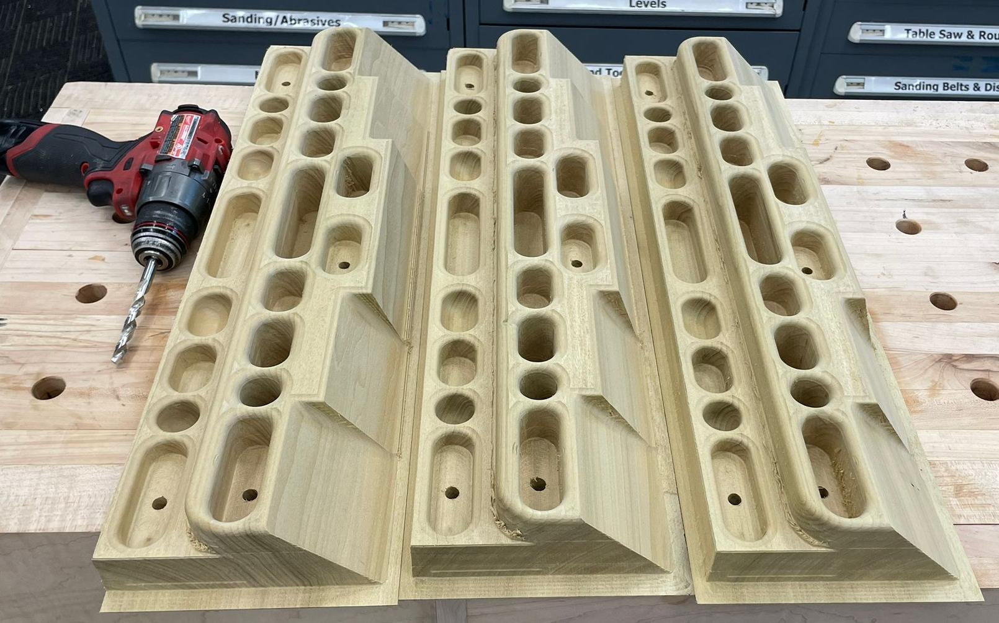
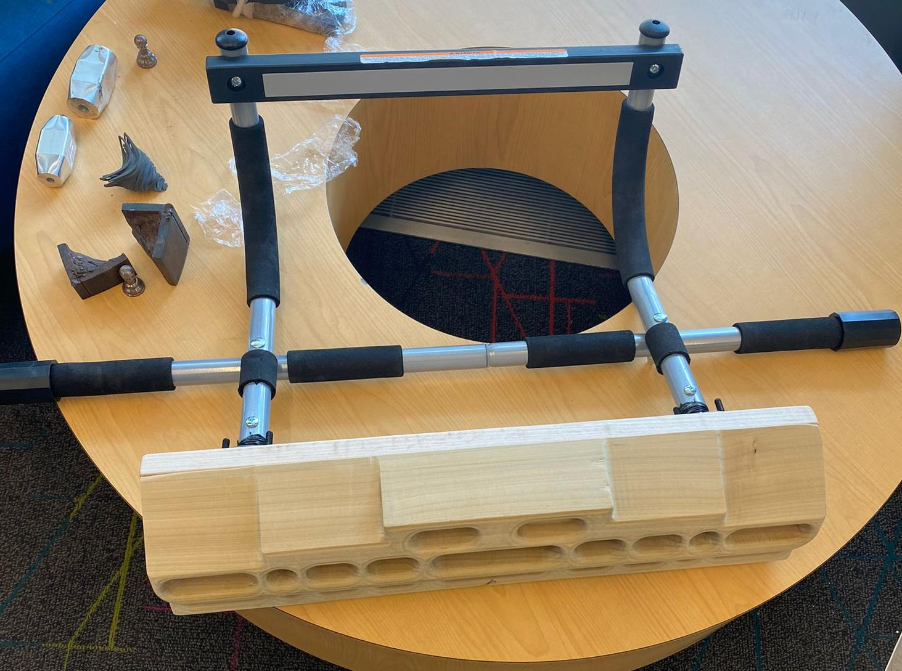
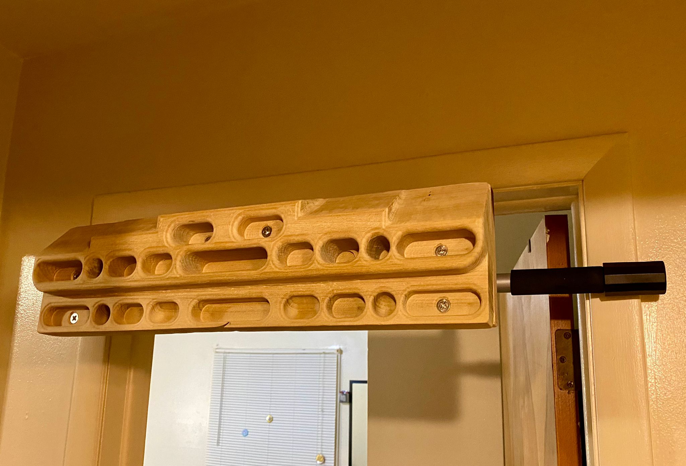
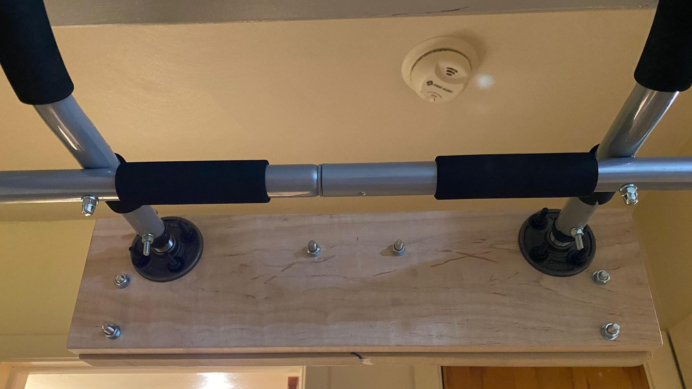
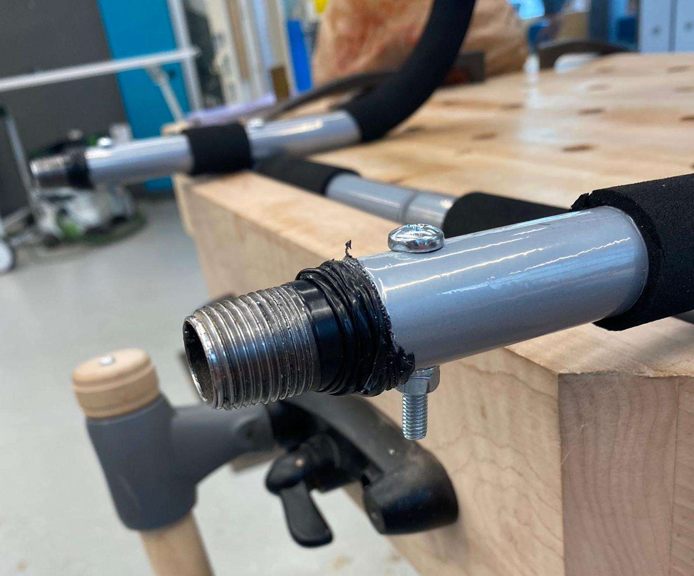
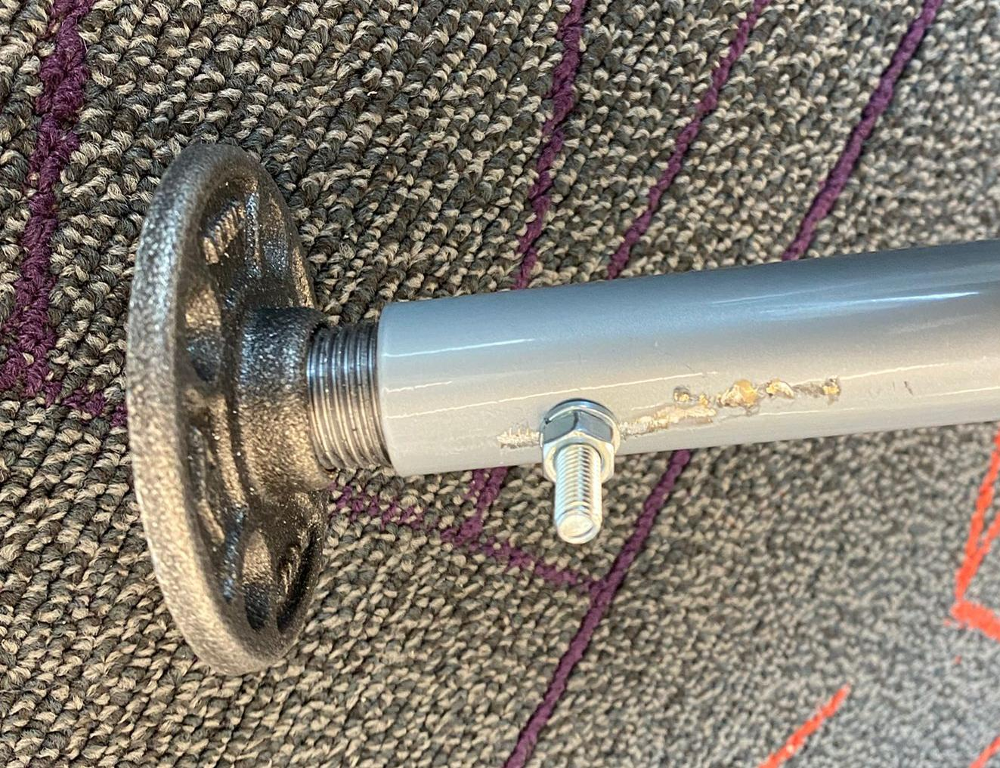

  <h1 align="center"><ins>Do It Yourself: Hangboard </ins> 🪨🧗🏋️‍♂️</h1>
  

    <a href="https://www.linkedin.com/in/rahul-deshmukh-purdue">Rahul Deshmukh</a>
    ·
    <a href="https://linkedin.com/in/amith-kashyap">Amith Kashyap</a>
    .
    <a href="https://linkedin.com/in/meghnaroyc">Meghna Roy Chowdhury</a>
  

  <!-- <h2 align="center">
    <a href="https://www.thingiverse.com/thing:2802378" align="center">CAD</a> | 
    <a href="link" align="center">CAM</a> 
  </h2> -->

This repository provides the details of how we created our own DIY hangboard and assembled it on a door-frame mountable pull-up bar. This device is used for strength tranining of fingers for climbing. There are a few designs that are available on market for purchase but they can be a bit costly (upwards of $200) which may make it less accessible to everyone. Our goal for this project was to make something on our own and pickup some CAD/CAM/Machining skills. This was a hobby project and is intended for personal use only.

The Hangboard is similar to the BeastMaker 2000 and we mounted it onto the Iron Gym Pullup bar using pipe fittings and baseboard. 
## Snapshots

<em>DIY Hangboard</em>
 

 

 
<em>Locking bolt</em>
 

Checkout the [Youtube video of CNC Machining](https://youtube.com/shorts/6XokEioxSRE?feature=share) and [Youtube video of CAM simulation](https://youtu.be/lj9m0k9sqps)

---
## Bill of Material

<detials>

Hangboard

- **Raw Material**: Poplar wooden stock machined to the size of (L: 7", W: 24" , D: 2.4"). This was provided by [BIDC](https://www.purdue.edu/bidc/)
- **Fasteners**: M8x1.25 Phillips head Machine Screws with Falt Washer and Hex Nut (Qty: 6). Out of the 6 screws, only one bolt was 80 mm long, others were 60 mm long.

<detials>

Baseboard

- **Raw Material**: Maple wooden stock machined to the size of (L: 6.5", W: 23" , D: 1"). This was provided by [BIDC](https://www.purdue.edu/bidc/)

<detials>

Pull-Up Bar

- **Pull-Up Bar**: [Iron Gym Pull-Up Bar from Amazon](https://a.co/d/fKwA3Nd)
- **Pipe Fittings**: 
    - Pipe Nipple: 1/2''x3 - 1/2'' Black Nipple (Qty: 2)
    - Flange: 1/2'' Black Floor Flange (Qty: 2)
- **Fasteners**:
    - Locking bolt for pipe fitting: M6 Machine Screw with Locking Washer and Hex Nut (Qty: 2).
    - Bolts for flange: Hex Bolt Black 1/4 - 20 x 2 with Flat Washer and Hex Nut (Qty: 8)

All fasteners and fittings were bought from Home Depot.

The total build costed roughly **$75**. The Pull-Up bar was half of this cost and the fasteners were the other half. However, the raw material cost is not included as they were provided by BIDC.

---
## Process Details

For the entire project we used these machines -- (1) Jointer, (2) Planer, (3) Miter Saw, (4) Table Saw, (5) CNC Router (SR-100 by HAAS), and (6) Hand drilling tools with metal and wooden drill bits. What follows next is a brief description of the processing details of each part.

**Hangboard**
- <ins>CAD:</ins> We used the [Beastmaker 2000 trainingboard by Newtonhal on Thingiverse](https://www.thingiverse.com/thing:2802378) as our CAD model. We converted the STL file provided by Newtonhal to a SLDPRT file and simplified the triangles to faces. This step was necessary for CAM.

- <ins>CAM:</ins> We used Autdesk Fusion 360 for CAM. BIDC provides access to their Gantry CNC CAM model which was used to do the CAM. We used a 3-axis CNC machine for the CAM and carried out the following operations -- (1) 2D Adaptive Clearing, (2) Steep and Shallow, (3) Drilling, and (4) 2D Contouring.

- <ins>Machining:</ins> The Hangoard was majorly machined using the CNC Gantry. We first prepared a wooden stock of the size detailed in BOM. To create the wooden stock, we first used the Jointer to create two flat edges. Then we used the Planer to machine the raw material to the designed depth (6"). We finally used the Miter Saw and Table Saw to cut the stock to the desired length and width. 

    &nbsp;&nbsp;&nbsp;&nbsp;&nbsp;&nbsp;After machining the wooden stock, we placed it onto the CNC Gantry. This involved, routing a gasket on the Gantry to allow for vaccum holding of the stock. Once the stock is tightly secured, we set the origin of the tool to the corner of our stock and then run the NC program for machining. Machining can take upto 4 hrs depeding on the feed rate of the tool.

    &nbsp;&nbsp;&nbsp;&nbsp;&nbsp;&nbsp;After the CNC, we carried out drilling of all blind holes to make them through holes. We also created counter sinks on the top surfaces of all the drilled holes to allow flushed fitting of fasterners.

- <ins>Post Processing:</ins> We filed and hand-sanded all the edges and surfaces of the hangboard to create smooth edges and surfaces. We did not stain of polish the wood as we need friction for hanging onto the hangboard.

**Baseboard**
- <ins>Machining:</ins> We machined the baseboard to the dimensions detailed in the BOM. We used the following sequence of machining operations --  (1) Jointer, (2) Planer, (3) Miter Saw, and (4) Table Saw. We then hand-drill holes corresponding to the hangboard mounting bolts (6 holes for M8 bolts). We also hand-drill the holes corresponding to mounting of the flange (4*2 holes for Hex bolts 1/4 - 20 x 2). Finally, we add countersinks for the flange bolts. The flange bolt heads will be concealed as they are sandwiched between the hangboard and the baseboard.

- <ins>Post Processing:</ins> We filed and hand-sanded all the edges and surfaces of the baseboard to create smooth edges and surfaces. We did not stain of polish the wood.

**Pull-Up Bar**

We carried out the following steps:
- <ins>Prep:</ins> Remove pastic caps and trim the soft grips on the Pull-Up bar pipes corresponding to chin-up exercise. 

- <ins>Assemble Pipe Fittings:</ins> We taped the pipe nipples using electrical tape. This was done to allow for a tight fit between the nipple and the pull-up bar pipe. After taping, we hammer the nipple into the pull-up bar pipes. Using some scrap wood as for hammering the nipple is adviced so as to avoid damaging the threads on the nipple. Also make sure that the two nipples are hammered roughly the same amount into the pipe. It is best to hammer till you can only see the threaded part. 

- <ins>Drill hole for locking bolt:</ins> We drill a vertical hole through the pull-up bar pipe and the fitted nipple. This hole is done to fit a locking bolt which prevents slipping of the nipple. 

- <ins>Attach the Flange:</ins> We finally screw the floor flanges onto the nipples.

**Assembly**

After fininshing the three components above, we first assembled the baseboard onto the pull-up bar by tightening the flange bolts. We then mounted the hangboard onto the baseboard and tightened all the fasteners on the hangboard.

---
## Future Improvements
- **Cost Reduction**: Change Metric fasteners to Imperial as they are cheaper in the US. This will require changes to be made to CAD and CAM.
- **Feature Addition**: Machine a slot on the top face of the baseboard for mounting smart-phone. This can be done with hand tools such as drilling + router. 
- **CAD Simplification**: During CAM we realized that the CAD model has a lot of fillets which will be hard to machine. These fillets are for aesthetics and can be simplified to a square edge. One can easily remove the square edge using hand tools and sanding during the post-processing. 

---
## Acknowledgement
We would like to thank [Bechtel Innovation Design Center - Purdue University](https://www.purdue.edu/bidc/) for providing a world class facility to students for building their designs. We would also like to thank the mentors -- Anuv Dhariwal, Anirudh Pal and Dan Bollock for their amazing support and guidance throughout the project. 

The CAD model was adopted from -- [Beastmaker 2000 trainingboard by Newtonhal on Thingiverse](https://www.thingiverse.com/thing:2802378)
